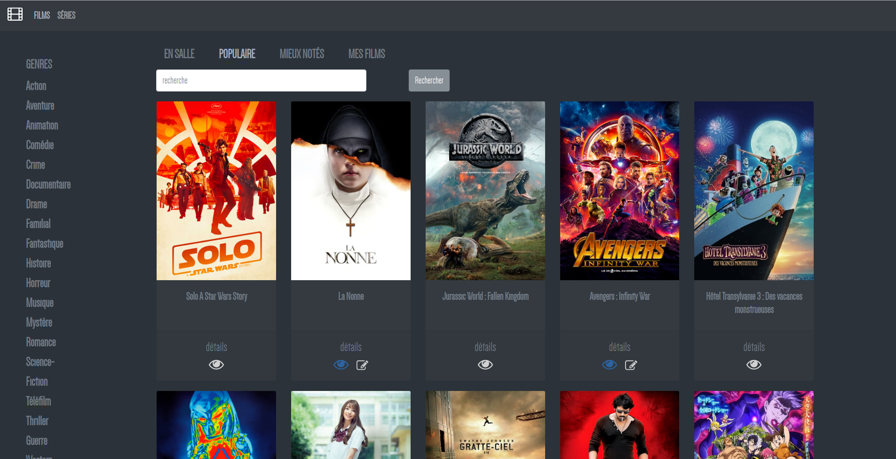
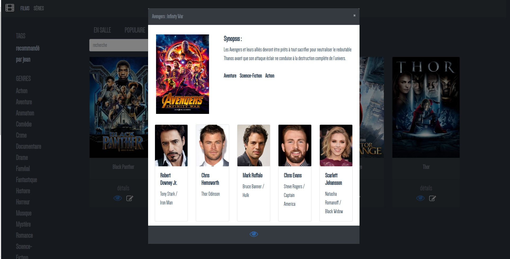

# MyMoviesApp

Une application pour gérer sa liste de films ou séries à regarder en y associant des commentaires ou des "tags" avec
possibilité de filtrer par mot clé, genre, tag enregistré.
Basée sur l'API [themoviedb](https://www.themoviedb.org/)

## Prérequis

### TheMovieDb

- Pour utiliser l'application il est nécessaire de posséder un compte développeur et de générer sa clé d'authentification
personnelle. Plus d'informations [ici](https://developers.themoviedb.org/3/getting-started/authentication)

### Git

- plus d'informations sur git [ici](git-github).
- Git [home](git-home) (téléchargement, documentation).

### Node.js et outils

- Télécharger [Node.js](node-download).

### MongoDB

- Le SGBD orienté document [MongoDB](https://www.mongodb.com/)

## Installation
### 1. Récupérer le code

- Via Git, en clonant ce dépôt (`git clone https://github.com/rivaultn/movies.git`)

### 2. Installer les dépendances

- Installer les dépendances (`npm install`).

### 3. Modifier la clé d'authentification

- Modifier la valeur de la constant 'PERSONAL_API_KEY' du fichier 'src/constant.js' par votre clé d'authentification
personnelle

### 3. Exécuter le projet

#### Choix 1

- Lancer la base de donnée (`mongod`)
- Exécuter le serveur avec le rechargement à chaud (`npm run dev`).
- Exécuter le projet (`npm run start`).

#### Choix 2

- Modifier le chemin `path/to/the/root/project` du fichier execute.sh et executer le script

### 4. (Optionnel) Créer un build de développement 

- Créer un build de développement (`npm run build`).

## Développé avec

* [MongoDB](https://www.mongodb.com/)
* [Mongoosejs](https://github.com/Automattic/mongoose.git)
* [Vuejs](https://github.com/vuejs/vue.git)
* [Vue-cli](https://github.com/vuejs/vue-cli.git)
* [Expressjs](https://github.com/expressjs/express.git)
* [Npm](https://github.com/npm/cli)

* L'API [themoviedb](https://www.themoviedb.org/)

## Auteur

* **Nicolas Rivault** - [rivaultn](https://github.com/rivaultn)
